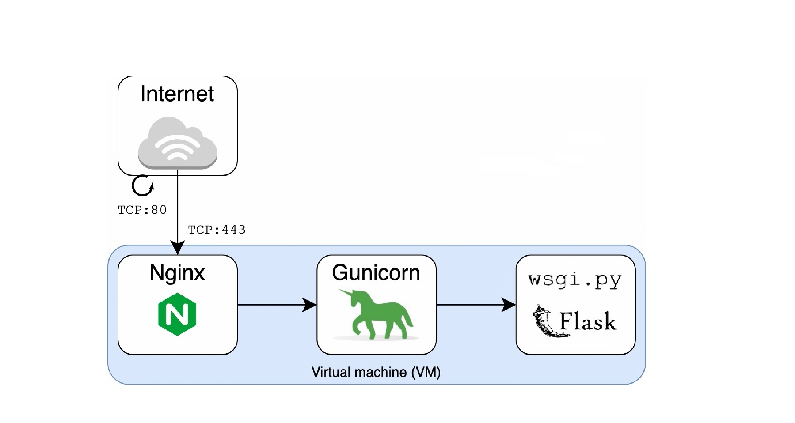

[](https://github.com/nvando/PUPPYLOVE/actions/workflows/run_tests.yml)


# PUPPYLOVE

My first python web application build using with the Flask and Bootstrap frameworks. The application is deployed using Gunicorn and Nginx as a reverse proxy, running on the VPS Digital Ocean. With Github Actions any code changes pushed to the main branch are tested automatically and auto-deployed to the server using SSH. 

This project was created for the Backend Development degree of Winc Academy. The web application is build using the following components:

 - Flask as the web development framework for the python web app
 - Boothstrap as a CSS framework, to UI style the webpages
 - WTForms for handling webform input and validation

The following components are used for deploying the application:

 - The app is run on a Virtual Private Server from Digital Ocean: a siloed space on a server with characteristics of an entire server itself. It has its own Operating System, applications, resources, and configurations.
 - Ubuntu is the operating system running on the VPS
 - Gunicorn is used as the application server or WSGI - a standard interface between the web application and web server. It translates the incoming HTTP requests into a python readable format and serves it to the Flask application. 
 - SystemD manages and daemonizes the Gunicorn process: it ensures that the application runs continuously and reloads or restarts automatically, even after a restart of the server due to updates or a power outage.
 
 - Nginx is used as the web server and serves as a reverse proxy. It forwards incoming HTTP requests to the application server Gunicorn, fetches a response, and sends it back to the client.
 - Github Action is the CI/CD platform, with workflows that test and deploy code automatically after pushing changes to the repository on Github.  
 - SSH public and private keys are used to authenticate and establish a secure connection between Github Actions and the VPS.   


  


 
## Continuous Integration and Continous Deployment

To test any changes to the application's code and autodeploy these changes on completion I use the Github Actions platform. My project folder contains two workflow files: run-tests.yml and deploy.yml:

1. The Run Tests workflow uses the 'Checkout repository', 'Install dependencies' and 'Run tests' actions. Any code changes pushed to Github will trigger this workflow to run the tests in ```test_main.py``` using Pytest. 
2. The Deploy workflow uses the 'scp-action' from Appleboy to securely copy the code to the VPS, thereby replacing the existing code on the server. This run is triggered only upon successful completion of the 'Run Tests' workflow. Github Actions will login to VPS as a specified user through SSH keys: a private key is added to the repository’s secrets on Github, and a public key was added to the authorized keys file within the .ssh folder of the git user on the server.

I have chosen to separate the 'Run Tests' job from the 'Deploy' job, instead of combining these steps within one workflow. In general, with large projects, it is preferred to keep the deployment steps in workflow files separate from the testing steps. Keeping workflows small and simple and referencing other workflows as opposed to combining multiple jobs in one workflow, makes it easier to reuse these workflows in the future, and between development and production branches.

For the Deploy workflow I have chosen a script that *pushes* the updated code from Github to the server through a secure copy. For security reasons, I preferred this option over writing a script that instead triggers a pull request from the VPS, *to pull* the updated code from Github into the servers repository. The first method only requires Github Actions to access to the VPS over SSH, while the latter also necessitates the VPS logging in to the Github repository.


*While setting up the CI/CD pipeline I encountered a few challenges. Below I describe three of them, together with my implemented solutions.*


***1. Reloading Gunicorn after code changes***

The Gunicorn service does not reload automatically after code changes in the project folder. This means that after the project's repository from Github was securely copied to the server using Deploy.yml, the SystemD service file for the web app still needed to be restarted manually.

I used another Github Action for executing this remote ssh command. With the below 'ssh-action' the Gunicorn service is commanded to reload after the SCP-action:

```

    - name: Executing remote command
      uses: appleboy/ssh-action@v0.1.4
      with:
        host: ${{ secrets.SSH_HOST }}
        USERNAME: ${{ secrets.SSH_USERNAME }}
        PORT: ${{ secrets.SSH_PORT }}
        KEY: ${{ secrets.SSH_PRIVATE_KEY }}
        script: | 
          ls -lha /var/www/PUPPYLOVE
          sudo systemctl reload PUPPYLOVE.service

```

I added this action as an additional step in the 'Deploy' workflow. Now, Deploy.yml will first secure copy all projects files and folders to the server, and then list all these files. Then, the server is commanded to reload the SystemD service file so that the code changes are reflected on the server. 


***2. Triggering one action only after another is completed***

The 'Deploy' job needed to depend on the testing job, with the code only being deployed to the server after the 'Run Tests' job has successfully completed. 

To use the Run Tests event as a trigger for the deployment step, I added the following to Deploy.yml so that it uses the workflow 'Run Tests' event as a trigger. 

```
on: 
  workflow_run:
    workflows: ["Run Tests"]
    types:
      - completed
```

This code results in the 'Deploy' workflow run being triggered after completion of the 'Run Test' workflow but regardless of it's conclusion. To run the 'Deploy' job only after the "Run Tests" workflow succeeds, I created a job condition with the 'github.event.workflow_run.conclusion' property:

```
jobs:
  
  build:
    runs-on: ubuntu-latest
    if: ${{ github.event.workflow_run.conclusion == 'success' }}
```

This job condition checks whether the previous workflow conclusion was a “success” before allowing the specific workflow execution.


***3. Enabling SSH access for non-root users***


As the root user is the administrative user in a Linux environment, it has very broad privileges. Because of the heightened privileges of the root account, it is preferred not to provide Github Actions root access to the server.  Therefor, I created a separate user on the server for Github Actions to login as.
 
Since Github Actions woudln't have root access, I needed to update permissions on the /var/www folder which contains the applications code. The new 'git user' needs read/write access to this project folder so that Github Actions can update the websites code with a secure copy of the respository.

To change the permissions on the var/www folder I followed the beneath steps.


1. First, I created a new group called webmasters, t which all users who need write access to the applications files should be added. I then added the 'git user' to this group with:
    ```
    addgroup webmasters
    adduser git webmasters
    ```
2. To change the owner of /var/www to root and the group to webmasters group is used:
    ```
    chown -R root:webmasters /var/www
    ```
3. I then added 664 permissions (-rw-rw-r–) to all files in /var/www and 775 permissions (drwxrwxr-x) to all directories in /var/www:
    ```
    find /var/www -type f -exec chmod 664 {} \;
    find /var/www -type d -exec chmod 775 {} \;
    ```
4. Finally, I set the SGID (Set-group ID) permission on the /var/www directory and all directories therein. This means that all files created in the directory will belong to the group (webmasters) of which the directory is a member. 
    ```
    find /var/www -type d -exec chmod g+s {} \;
    ```

In addition, I had to allow the 'git user' to restart the Gunicorn service file. As by default only root users are allowed to restart a SystemD service file, the git user needed sudo permission assigned. 

I used visudo to provide a limited command set to the users in the webmaster group for managing this specific service. 


I added the following to the visudo file:
```
%webmasters ALL=(ALL) NOPASSWD: /bin/systemctl reload myproject.service
```

This allows all users in the webmasters group, on all hosts, to run a specific command as root. Adding the NOPASSWD argument enables the git user to operate the service without the need of entering a password first, as this user is only authenticated by an SSH key.